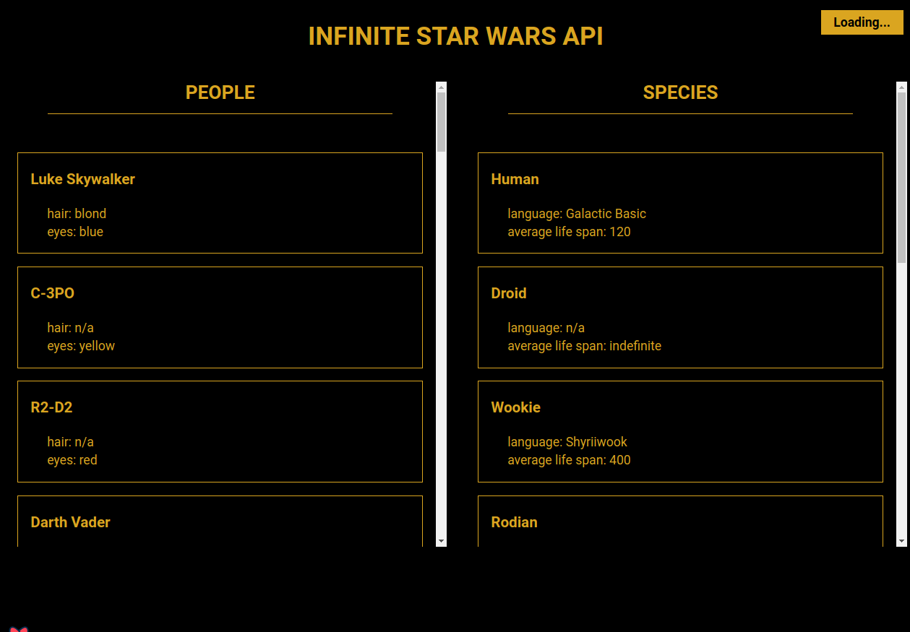

# STAR WARS API

This project is my practice of the course "React Query: Server State Management in React" in Udemy, for the topic 
"Infinite Queries for Loading Data 'Just in Time'".
You can take pieces of this code how reference for your projects.

Feel free to contribute with this project, make corrections and teach your good development practices.

You can see the app in https://petgram.smarulanda97.vercel.app

## IMPORTANT
- You can see the app in https://petgram.smarulanda97.vercel.app
- Required Node.js >= 12

## LIBRARIES

* React
* React Query

## LICENCE

MIT
